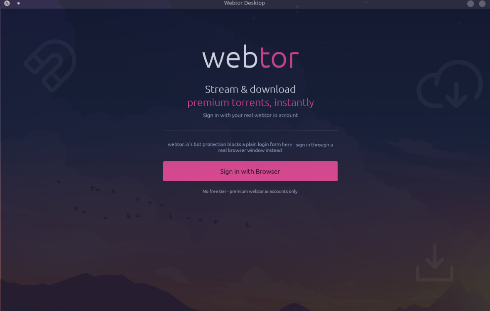

# Webtor Desktop

A native Linux desktop client for [webtor.io](https://webtor.io) - browse, download, and stream torrents with a real BitTorrent engine, real webtor.io login, and mpv-powered playback.

